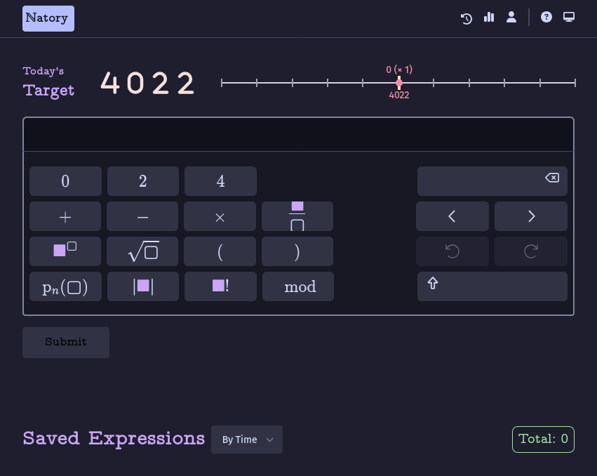
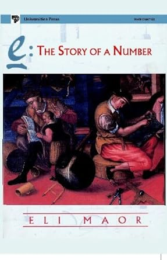
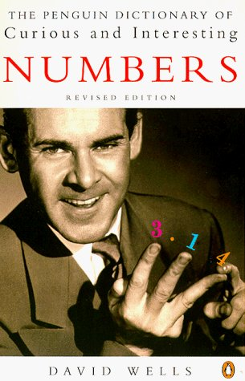

Around the year 2000, about 25 years ago, I was sitting in class, bored with what the teacher was saying, when I started playing a game. I took a number and tried to form it using its own digits and some basic mathematical operators. It quickly became one of my favorite pastimes. Whenever I was bored, I would pick a number and experiment with different ways to construct it.

Over time, this transformed into more sophisticated exploration. One day in a math class, I started playing with the [Wallis product](https://en.wikipedia.org/wiki/Wallis_product) for π. I had recently read (or was reading) a book called [e: The Story of a Number](https://www.amazon.com/Story-Number-Eli-Maor/dp/8173712123). Somehow, I derived an infinite series that connected π to e. Excited, I showed it to my math teacher, who, without saying a single word, simply wrote down:

eix = cos x + *i*sin x

Of course, replacing x with π, gives the famous eiπ = -1

That moment was both humbling and fascinating. I don’t remember exactly what I had discovered, but I do remember the thrill of finding something unexpected. Unfortunately, the teacher of the next class did not like the fact that I had not taken his permission to talk to my math teacher during his class. 😅

One fascinating class of numbers is [Friedman numbers](https://erich-friedman.github.io/mathmagic/0800.html), numbers that can be expressed using their own digits together with the symbols + – × / ^ ( ) and concatenation, in a meaningful equation. Such as 25 = 5² or 126 = 21 × 6. The interesting thing is that Erich Friedman introduced these numbers around the year 2000. At the same time I was doing something very similar, completely unaware of their existence. I only came across Friedman numbers a couple of years ago. It was a nice feeling that something similar was being studied by others, that the child me was exploring.

At some point during those years, I had borrowed [The Penguin Dictionary of Curious and Interesting Numbers](https://en.wikipedia.org/wiki/The_Penguin_Dictionary_of_Curious_and_Interesting_Numbers) from my local library. It was one of the books that deepened my fascination with numbers. It was filled with strange and wonderful properties of numbers, which I loved exploring. Looking back, I believe that book played a significant role in inspiring what eventually became [ℕatory](https://playnatory.com).

As I grew older, I stopped playing this game as frequently, but every now and then, I would return to it. When I turned 23, I remember playing with 19 (my birth date) and 23, forming all sorts of silly equations using those digits.

Years later, I thought, _there must be at least one other person who would enjoy this as much as I do_. I wanted to share the joy of playing with numbers. With my background as a developer, I decided to turn this childhood pastime into a browser-based game. I named the game [ℕatory](https://playnatory.com), short for the **Nat**ural Number Fact**ory**. In ℕatory, players are given a number daily, and they must construct expressions that evaluate to that number itself. They are allowed to use only the digits of that number and mathematical operations provided in the game.

## Math as a Creative Process 🎨➕

One thing I feel strongly about is that math is not just about logic or blindly following rules, it is one of the most creative fields. Yet, most people don’t see it that way. Even as a child, I realized this and wanted to pursue higher math, as I believed I was meant to do something that was both logical and creative. Little did I know, destiny would take me to software instead of math. 🤷‍♂️

People usually associate math with rigorous processes and rigid formulas. However, the type of mathematics that mathematicians do involves creativity, exploration, and intuition.

To arrive at a proof, mathematicians do more than follow predetermined rules. They imagine, explore, and play with concepts until something clicks. I want Natory to offer that kind of experience. It is not about solving fixed problems—it's about discovering patterns and making connections.

## Only the Beauty of Numbers

From the start, I decided that ℕatory wouldn't have flashy animations or an overly decorated UI. I want the beauty of numbers to take center stage, not the interface.

Also, let's be honest, my design skills aren't exactly world-class. 😆 If I tried to make ℕatory visually stunning, I'd probably just make it worse! So, I chose to embrace simplicity. The game is meant to be clean and distraction-free, letting players focus on exploring numbers rather than being overwhelmed by effects or unnecessary design elements.

Another aspect of ℕatory that excites me is the presence of special numbers. Some numbers have unique mathematical properties, appear in well-known [sequences](https://oeis.org/), or contain patterns that set them apart. In the game, recognizing these hidden structures can be rewarding, but I won't reveal which of them are recognized by the game. That's for the players to discover. 🕵️‍♂️

## Building Natory 🏗️

It took about a month to build the basics of the game. Later, I introduced the concept of "gems", special numbers that have unique patterns or belong to famous mathematical sequences. If players manage to express these numbers using their fundamental formulas, they earn a bonus based on the rarity of the pattern. Designing the scoring system has been an interesting challenge, and I plan to refine it further based on player feedback.

I don't have a rigid roadmap for ℕatory, and I prefer it that way. I don’t want to overload it with features—just enough to make it engaging while preserving its simplicity.

The core game will always remain free to play. I have planned some paid features, such as revisiting earlier numbers and private leaderboards, but the focus will always be on providing a simple, enjoyable experience for those who love numbers.

If you have any feedback, please share it on [Twitter](https://x.com/playnatory), or send an email at 📩 [support@playnatory.com](mailto:support@playnatory.com)

## Why I Built This Game?

Ultimately, I built ℕatory because I wanted to share the joy I've always found in numbers. If even one person finds the same sense of wonder playing this game that I did as a child, that would make it all worthwhile. ❤️

Go ahead create something beautiful. Play [ℕatory](https://playnatory.com).
