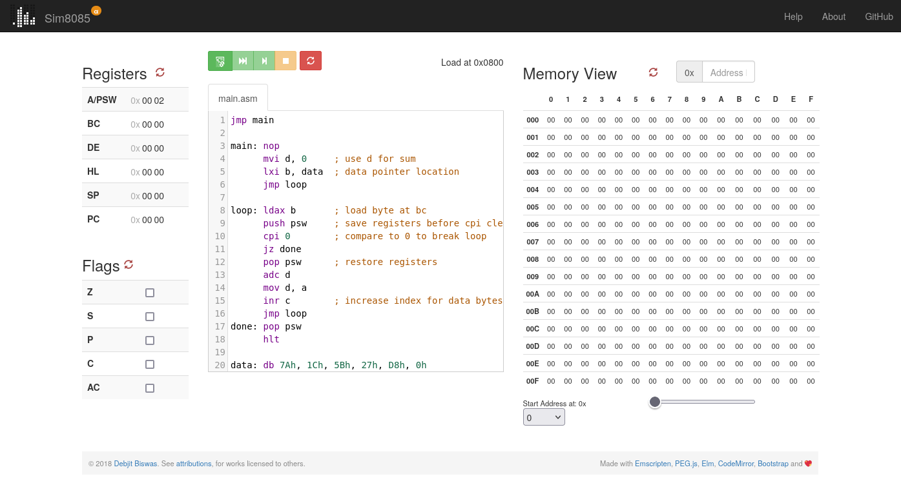
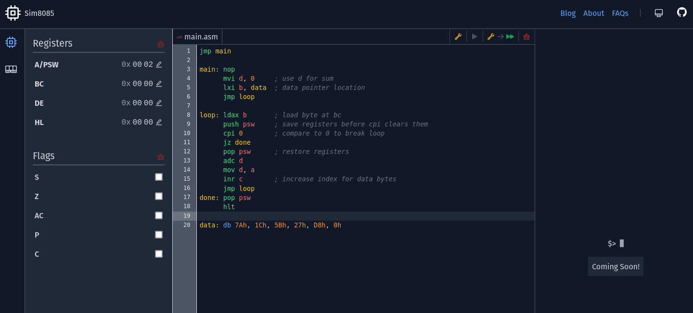

Almost eight years ago, while between jobs, I launched
[Sim8085](https://www.sim8085.com) — a project I had envisioned during my college
days but hadn't fully realized until then. It’s an application that lets
users write simple 8085 assembly programs and run them in a simulator. Sim8085
wasn't just an experiment; it was my first full-fledged application with real
users and an open-source project I was responsible for. Solving a problem I
faced in college and seeing it later used by students worldwide has been
incredibly rewarding.

Sim8085 - Version 1

## The College Days: Where It All Began 🎓

I first encountered applications like this during college, while taking a course
on Microprocessors. The 8085 microprocessor was the platform we used for
programming. We had kits in the lab, where we had to input the hex codes and
show the output. I remember the frustration of manually entering hex codes, only
to realize that one small mistake could throw off the entire program. That’s
what pushed me and other students to start searching for simulators outside of
lab hours. We would often write, test, and 'compile' the program ahead of time,
bringing the hex codes with us to the lab. This was not allowed, but since the
time in the lab was short to write the code, then 'compile' it by hand, we used
to write everything in a simulator. If we finished too quickly, we'd be given
a new problem, so we had to manage our speed carefully.

While taking this subject, I realized many of the simulators only worked on
Windows. I was a dedicated Linux user and steered clear of Windows entirely. So,
I searched for 8085 simulators that worked on Linux and found
[GNUSim8085](https://gnusim8085.srid.ca/). It is good software and many people
are still using it, but it too had some bugs and the user experience was not
good.

Later on, I [contributed](https://gnusim8085.srid.ca/halloffame) several UI
improvements to GNUSim8085, which was a great learning experience. But after a
while, I realized I wanted something more flexible and modern—something that
would work across platforms, especially Linux. I wanted to create a web-based
8085 simulator (I had originally thought of creating a full-fledged simulator
with cycle simulation, which is why I named it Sim8085, but I decided to aim for
a smaller goal) that students could use, regardless of their OS and would be
free of major bugs.

## The Launch of Sim8085 🚀

Over time, I continued developing the core emulator and assembler, but the UI
remained on hold due to my day job and other commitments. Finally, 8 years ago,
while between jobs, I decided make the UI and use the opportunity to learn Elm,
a language I had wanted to explore. I had two months, and it was enough to
launch a basic version. It supported stepping through code and debugging too. I
was all in on pure functional programming and even introduced Elm and Haskell in
the next job. Not having to deal with runtime errors, designing with types was
some thing I liked immensely.

This was good and I was happy to have finally launched something I had thought
about for many years. I knew many people were using the application. What
surprised me the most was the number of students and professors reaching out
with feedback or questions. It was incredible to see Sim8085 being used in ways
I hadn't anticipated, like as a teaching tool in classrooms across the world, in
YouTube tutorials, and even offline without an internet connection. I tried my
best to keep up with bug fixes and improvements, but over time, I realized that
Sim8085 had inherited some of the same bugs that plagued other similar
applications. With my other commitments piling up, it became increasingly
difficult to maintain it at the level I wanted.

## The Turning Point: Redesigning Sim8085 🛠️

After years of small improvements and bug fixes, I hit a wall: my development
environment was no longer viable. Elm 0.18 would not even install on my machine.
Maybe I could get it up, with some difficulty, but it was not going to be a
sustainable way to develop it further. This was a turning point — time to
redesign Sim8085 from the ground up with modern technology, which will work for
at least next 5 years.

Redesigned Sim8085

I have tried this same thing in the past once, when I tried to write the
emulator in Rust and the frontend in React. I had completed the emulator but got
stuck with the frontend, again because of time and effort. This time I wanted to
reduce the efforts required as much as possible, so I decided only to redesign
the frontend first and release the version, before going for the emulator and
the assembler. Both the emulator and the assembler have been working fine. I had
written the emulator in C (compiling to JS using
[emscripten](https://emscripten.org/)) and the assembler in
[Peg.js](https://github.com/pegjs/pegjs) now succeded by
[Peggy](https://peggyjs.org/), and both are still supported well enough for me
to continue working with them for at least some more time. I would be able to
fix bugs in them without replacing, emscripten and Peggy for sometime.

## The New Tech Stack: [Astro](https://astro.build/) and [SolidJS](https://www.solidjs.com/) 🌟

For the frontend this time I chose, Astro and SolidJS. I had built a one page
application with Astro and AlpineJS a few weeks ago and liked how Astro made
things simpler and also fit my intuition about how components should be
structured (more on this in a future blog post). I had heard a lot about
SolidJS, and with my experience in React and my interest in signals, it seemed
like the perfect opportunity to experiment with it.

I can happily report that the redesign has been going well. Not only was I able
to successfully redesign the frontend, but I also managed to fix several
long-standing critical bugs. The missing feature at the time of writing this is
the support for breakpoints. I was even able to add some new features, such as
`ORG` directive, better way to view & edit the memory.

Both Astro and SolidJS have proved to be simple enough to work with and do what
I want to do. I started using Astro to be able to write components the right way
(IMO), but with that I was got a lot more, without much effort, such as
pre-rendering components, controlling loading and hydrating components, making
only the core in SolidJS and using plain HTML, CSS and some Alpine for other
parts and of course really great performance. The greatest surprise was how
easily I was able to render SolidJS components outside the SolidJS component
tree and still use the same global state using the createStore signals, which
allowed me to maintain global state across components without compromising
performance.

There is still some way to go before I release the [redesigned
application](https://astro-solid--sim8085.netlify.app/), but this time, it is
going to happen, because I am between jobs again 😝
